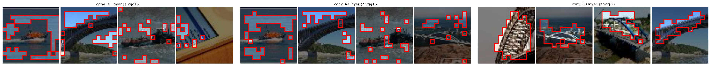
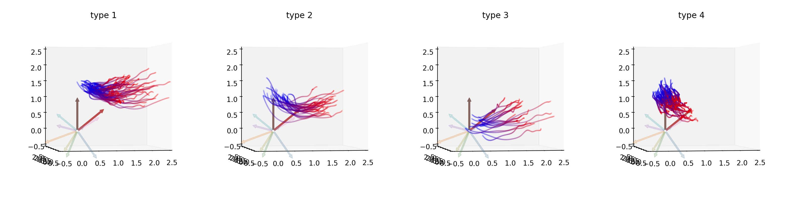

# Visualizing the Emergence of Intermediate Visual Patterns in DNNs

PyTorch implementation for the paper "[Visualizing the Emergence of Intermediate Visual Patterns in DNNs](https://arxiv.org/abs/2111.03505)" (NeurIPS 2021)

## Requirements

Mainly based on PyTorch and NumPy.

## Minimal Examples

To train the sample embeddings $g=Mf$,

~~~python
from embeddings import SampleEmbedding

sample_emb = SampleEmbedding(in_dim=in_dim, out_dim=3)
sample_emb.fit(
    data={"target_probs": probs, "sample_features": features},
    params={"lr": lr, "n_step": n_step}, verbose_dir=save_dir
)
~~~

To train the importance weights $w^{(r)}$ and $v^{(k)}$,

~~~python
from embeddings import ImportanceWeight

importance_weight = ImportanceWeight(*regional_features.shape)
importance_weight.estimate(
    data={"target_probs": probs, "regional_features": regional_features, "images": images},
    params={"lr": args.lr, "n_step": args.n_step}, verbose_dir=save_dir,
)
~~~

To train the regional embeddings $h^{(r)}=\Lambda f^{(r)}$,

~~~python
from embeddings import RegionEmbedding

region_embedding = RegionEmbedding(in_dim=in_dim, out_dim=3)
region_embedding.fit(
    data={"target_probs": probs, "regional_features": regional_features,
          "sample_embs": sample_emb, "w_k": kernel_weights, "w_r": region_weights},
    params={"lambda_kl": args.lambda_kl, "lambda_mi": args.lambda_mi,
            "lr": args.lr, "n_step": args.n_step}, verbose_dir=save_dir
)
~~~

## Usage

Codes for training models and extracting features are omitted. However, you can download the extracted feautures in the *Demos* section. We extract intermediate-layer features of 500 samples in the Tiny-Imagenet-10 dataset used in this paper.

In order to obtain sample embeddings and regional embeddings, you need to run the following code.

~~~shell
python train_sample_emb.py
python train_importance_weight.py
python train_region_emb.py
~~~

You can also specify the dataset and the DNN by yourself. For more information, please add the `--help` flag at the end of each command above.

## Demos

We have also provided demos to reproduce experimental results presented in the paper. Raw data will be uploaded soon.

- Visualize knowledge points in different layers, [`visualize-knowledge-point.ipynb`](./visualize-knowledge-point.ipynb)

  

- Visualize the change of knowlegde points before/after the adversarial attack, [`visualize-attack-region.ipynb`](./visualize-attack-region.ipynb)

  

- Visualize trajectory of regional features throughout the attack, [`visualize-attack-trajectory.ipynb`](./visualize-attack-trajectory.ipynb)

  

## Bibtex

If you find this work useful to your study, please cite this paper as follows.

~~~
@article{li2021visualizing,
  title={Visualizing the emergence of intermediate visual patterns in dnns},
  author={Li, Mingjie and Wang, Shaobo and Zhang, Quanshi},
  journal={Advances in Neural Information Processing Systems},
  volume={34},
  pages={6594--6607},
  year={2021}
}
~~~
